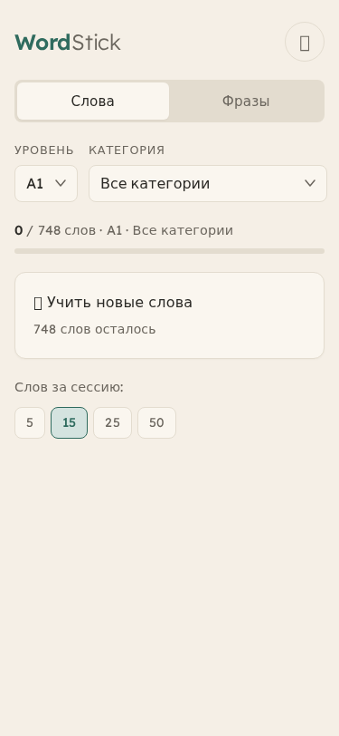
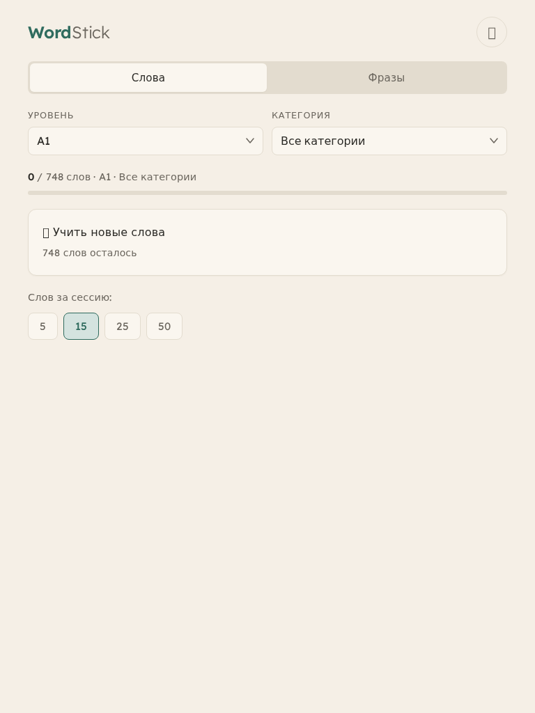
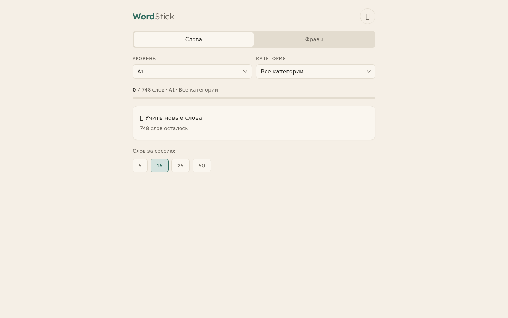

# WordStick

English vocabulary trainer for Russian-speaking engineers. Covers A1–C2 (16,032 words, 909 phrases) with an interface designed for dyslexia, dysgraphia, and ADHD.

**Live:** https://yapavelkulikov-dev.github.io/WordStick/

---

## Screenshots

| Mobile (375px) | Tablet (768px) | Desktop (1440px) |
|:-:|:-:|:-:|
|  |  |  |

---

## Features

- **16,032 words** across 6 CEFR levels (A1–C2)
- **909 phrases** with tap-to-assemble phrase builder
- **34 categories** — from basic household to advanced engineering, science, and academic discourse
- **75 vintage illustrations** generated with FLUX.2-dev on A100 GPUs
- **Text-to-speech** with 30% audio-only quiz mode
- **Mastery tracking** — 3 correct answers to "close" a word; review queue for mistakes
- **Offline** — works fully after first page load
- No accounts, no tracking, no backend

---

## How It Works

1. Choose a level (A1–C2) and category
2. **Study** — browse word cards with image/emoji, translation, word forms, and examples. Auto-TTS on each card
3. **Quiz** — 6-option multiple choice (or audio-only mode). Progress dots track toward 3 correct
4. Words needing review are flagged and appear in a dedicated review session
5. **Phrase Builder** — see the Russian phrase, tap English word chips into the correct order

Progress is saved in `localStorage` — no login required.

---

## Quick Start (local dev)

```bash
git clone https://github.com/yapavelkulikov-dev/WordStick.git
cd WordStick
npm install
npx http-server . -p 8080 -c-1
# open http://localhost:8080
```

Run tests:
```bash
npx playwright test
# 29 tests, ~23 seconds
```

---

## Content

| Level | Words | Phrases | Focus |
|-------|------:|-------:|-------|
| A1 | 748 | 150 | Basic nouns, tools, small talk |
| A2 | 750 | 150 | Travel, business, daily communication |
| B1 | 1,008 | 150 | Idioms, professional phrases, meetings |
| B2 | 1,500 | 159 | Advanced professional and academic |
| C1 | 4,014 | 150 | Specialist: science, law, finance |
| C2 | 8,012 | 150 | Ultra-advanced: 80+ scientific domains |
| **Total** | **16,032** | **909** | |

---

## Tech Stack

| | |
|--|--|
| Frontend | Vanilla JS + CSS, no build step |
| Font | [Lexend](https://fonts.google.com/specimen/Lexend) (dyslexia-friendly) |
| Storage | `localStorage` |
| Hosting | GitHub Pages |
| Testing | Playwright (29 tests) |
| Images | FLUX.2-dev via ComfyUI on 2× NVIDIA A100 |

---

## Documentation

| Doc | Contents |
|-----|----------|
| [01-OVERVIEW](docs/01-OVERVIEW.md) | Project goals, target audience, design philosophy |
| [02-HISTORY](docs/02-HISTORY.md) | Development phases, decisions, image style iterations |
| [03-CONTENT](docs/03-CONTENT.md) | Data formats, all 34 categories, how to add content |
| [04-IMAGES](docs/04-IMAGES.md) | ComfyUI setup, FLUX prompts, generation parameters |
| [05-ALGORITHM](docs/05-ALGORITHM.md) | Learning algorithm, localStorage structure, weighted random |
| [06-DESIGN](docs/06-DESIGN.md) | UI/UX decisions, color palette, typography, accessibility |
| [07-SETUP](docs/07-SETUP.md) | Local dev, ComfyUI dual-GPU setup, file structure |
| [08-DEPLOY](docs/08-DEPLOY.md) | GitHub Pages deployment, Playwright test coverage |
| [09-ROADMAP](docs/09-ROADMAP.md) | v2 plans: SRS, reverse quiz, voice input, dark mode |

---

## License

MIT — free to use, modify, and distribute.
